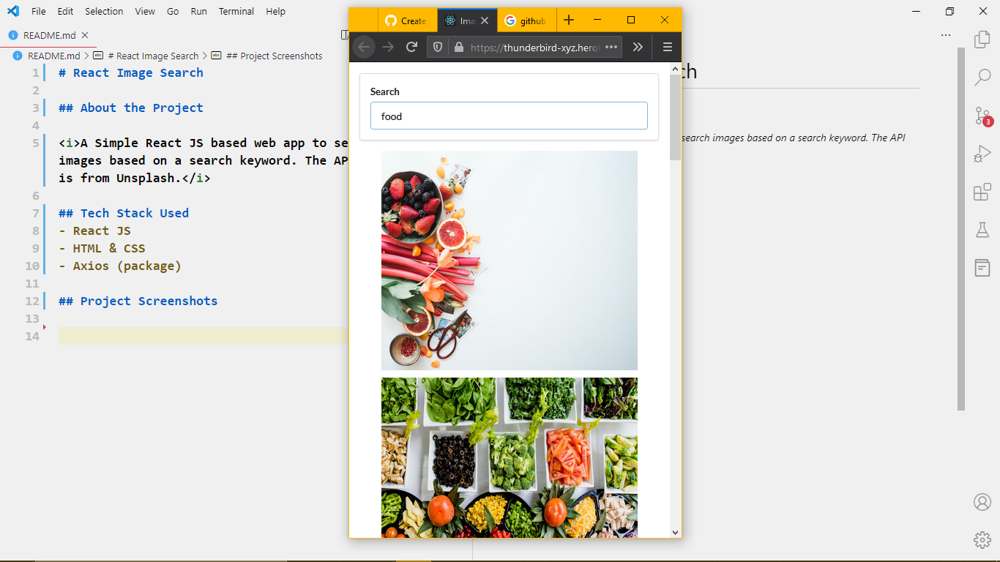
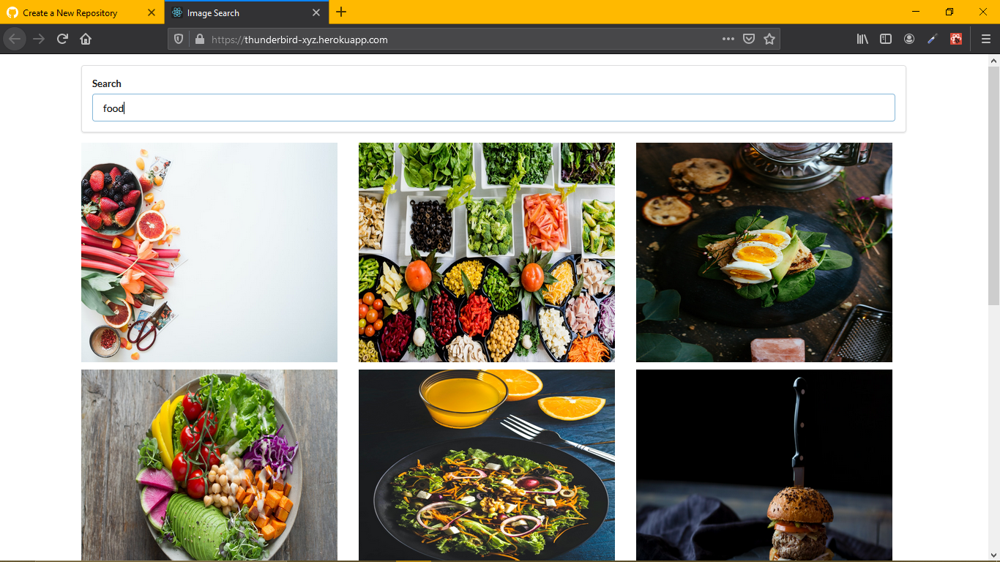

# 👋 React Image Search 👋

## About the Project

<br>

<i>A Simple React JS based web app to search images based on a search keyword. The API taken is from Unsplash.</i> 

## Tech Stack Used
<br>

- React JS
- HTML & CSS
- Axios (package)

## How to Run ?
<br>

```
cd React-Image-Search
yarn add
yarn start
```

<b>Note:- The Project will be available at http://localhost:3000
</b>

## Project Screenshots
<br/>
<center>
<label><b>Responsive Image</b></label>


<label><b>Full Screen Image</b></label>

</center>

